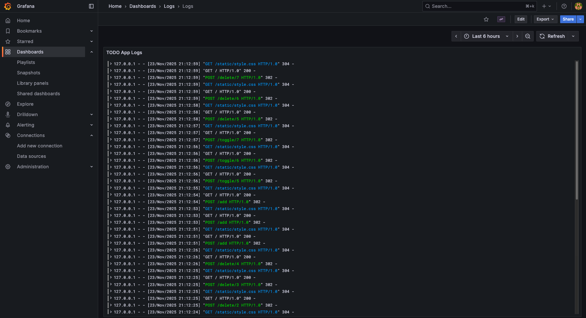

# DevOps Auto Deployment

This repository contains scripts for deploying a simple to-do app written in Flask.

## Services
- App
- Postgres
- Nginx
- Alloy
- Loki
- Grafana

### App
The app is written in Python and uses Flask as the framework.
It supports adding new to-do items, marking them complete and deleting them.

It is accessible on http://app.localhost in vagrant deployment and http://app.devops.gapi.me in cloud-init deployment.

<video src="assets/app-demo.mp4" controls preload></video>

### Nginx
Nginx is a reverse proxy that handles routing traffic to all other services.

### Alloy
Alloy reads the app logs from a file every 5 seconds and sends them to Loki.

Its dashboard is accessible on http://alloy.localhost in vagrant deployment and http://alloy.devops.gapi.me in cloud-init deployment.

### Loki
Loki stores logs in its database.

### Grafana
Grafana queries logs from Loki and displays them in a dashboard.

It is accessible on http://grafana.localhost in vagrant deployment and http://grafana.devops.gapi.me in cloud-init deployment.




## Deployment

The installation scripts are seperated by each service and are located in `scripts` folder.
They are designed to work with vagrant as well as cloud-init.

Configuration files needed by apps are located in `configs` folder.
Vagrant supports copying files directly into the virtual machine.
For Cloud-Init a helper script is used to embed the configuration files into one Cloud-Init script.

### Vagrant

<video src="assets/vagrant-deployment.mp4" controls preload></video>

#### MacOS (Apple Silicon)

Install qemu
```bash
brew install qemu
```

Install plugin
```bash
vagrant plugin install vagrant-qemu
```

Deploy
```bash
vagrant up --provider qemu
```

#### Windows

Install [VirtualBox](https://www.virtualbox.org/wiki/Downloads)


Deploy
```bash
vagrant up
```

### Cloud-Init

<video src="assets/cloud-init-deployment.mp4" controls preload></video>

Run `gen-cloud-init.sh` script that generates a full cloud init configuration from the template.
The script encodes required files into base64 and inserts them into the generated configuration.

```bash
./gen-cloud-init.sh ./cloud-init-template.yaml ./cloud-init.yaml
```

#### Proxmox

Upload generated configuration file to Proxmox as a snippet

Create a new vm and run command
```bash
qm set $VMID --cicustom "user=local:snippets/cloud-init.yaml"
```